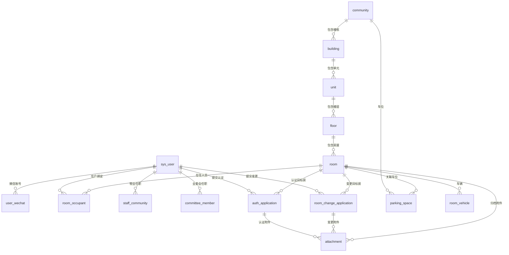

# 03 · 第一阶段 · 数据模型设计说明书

| 项 | 说明 |
|---|---|
| 文档编号 | 03 |
| 文档类型 | 数据模型（**一阶段 D.1～D.4 全量**；对齐 01-Q18） |
| 文档状态 | **须对照实现修订（V1.3 增量说明如下）；待正式上线** · 权威 DDL 见 `schema-h2.sql` |
| 对应需求 | [01-需求规格说明书-V1.2.md](./01-需求规格说明书-V1.2.md)（**① 业务真相源**） |
| 对应选型 | [02-技术选型说明书.md](./02-技术选型说明书.md)（②） |
| 下一文档 | [04-第一阶段-API接口清单.md](./04-第一阶段-API接口清单.md)（④） |
| 文档链 | ①01 → ②02 → ③03 → ④04 → 编码 |
| 本文读者 | 产品 / 非专业库表人员也可通读；开发可直接按表建库 |
| 阶段范围 | **D.1** 身份房屋…；**D.2** §10 费项账单；**D.3** §11 财务公告报修投诉；**D.4** §12 投票 |
| 一阶段其余表 | 已覆盖 D.1～D.4。**二阶段（E）不在本文** |
| 数据库 | MySQL 8.0，引擎 InnoDB，字符集 utf8mb4（支持中文与表情） |
| 更新日期 | 2026-09-28 |

---

## 实现对照附录（V1.3 · 2026-09-28）— 上线必读

正文 §11.4～11.6 等仍保留早期 `repair_order` / `complaint` 描述，**以本附录与代码为准**。

### A. Schema 权威与 MySQL 脚本

| 来源 | 路径 | 说明 |
|---|---|---|
| **权威（最全）** | `server/src/main/resources/db/schema-h2.sql` | 本地 H2 初始化；含预缴协议、豁免、统一工单、巡检、Banner、about_us 等 |
| MySQL 增量 | `sql/V1`～`V7` | **不完整**；正式上线前须补 `V8` 或导出生产基线（见 [05](./05-上线联调清单.md) §3） |

### B. 统一服务工单（替代 §11.4～11.6）

报修与投诉统一落表 **`service_ticket`**（及答复/附件关联）。旧表名 `repair_order` / `repair_reply` / `complaint` 仅存在于历史文档与部分迁移脚本，**新库以 `service_ticket` 为准**（`sql/V6__service_ticket_unified.sql`）。

能力要点：按岗位派单、一线接单（claim）、完工、多维评价、客服/经理 Web + 一线小程序。

### C. 公共收益（§11.2）

需求（01-Q28）：提交后**直接 PUBLISHED**，无业委会确认。表可保留历史确认字段，**业务不得再走确认闸门**。上线前须保证 API 与表状态机一致（当前后端 Controller 缺失，见 05 §5.1）。

### D. 其它已落地表/字段

| 对象 | 说明 |
|---|---|
| `prepaid_plan` / `prepaid_plan_item` | 预缴协议方案 A（非旧余额钱包；旧 `prepaid_account` 等勿再作为主路径） |
| `room_fee_exemption` 等 | 房屋费项豁免 |
| `notice.show_on_banner` / `banner_order` | 首页 Banner（V7） |
| `inspect_spot` / `inspect_plan` / `inspect_plan_spot` / `inspect_job` / `inspect_visit` | 巡检 |
| 岗位枚举 | `PROPERTY_MANAGER`、`CUSTOMER_SERVICE`、`SECURITY`、`CLEANING`、`LANDSCAPING`、`FACILITY_MAINT`（`PROPERTY_ADMIN` 归一为客服） |

---

## 0. 先读：用生活例子理解「表」

可以把数据库想成很多张 **Excel 表**，但规则更严：

| 概念 | 白话 | 例子 |
|---|---|---|
| **表（Table）** | 一类信息的清单 | 「小区表」「房屋表」 |
| **行（Row）** | 一条具体记录 | 「阳光花园」这一条小区 |
| **列 / 字段（Column）** | 一种属性 | 小区名称、地址 |
| **主键 id** | 这行的身份证号，表内不重复 | 小区 id=3 永远指阳光花园 |
| **外键** | 本表某列填的是「另一张表的 id」 | 房屋表里的 `community_id=3` 表示属于阳光花园 |
| **索引** | 为了查得快建的目录；「唯一索引」还保证不能重复 | 同一楼层下不能有两个「1302」 |
| **枚举值** | 事先约定好的英文代码，程序里当状态用 | `OWNER` 表示业主 |

**为什么不用姓名当主键？**  
姓名会改、会重名。用自增数字 `id` 最稳，关联时只传数字。

---

## 1. 设计约定（全文通用）

### 1.1 几乎每张表都有的「通用字段」

| 字段名 | 类型怎么读 | 必填 | 白话说明 |
|---|---|---|---|
| `id` | BIGINT，主键，自动递增 | 是 | 本行唯一编号。新建一行时数据库自动给 1、2、3… |
| `created_at` | 日期时间（到毫秒） | 是 | 何时创建 |
| `updated_at` | 日期时间 | 是 | 何时最后修改 |
| `deleted_at` | 日期时间，可空 | 否 | **软删标记**：填了时间 = 业务上当作已删除，行仍保留；空 = 未删除。小区/楼栋/单元/楼层/房屋等主数据统一启用；流水类表见各表说明 |

**软删 vs 硬删（再强调一次）：**

- 软删：给 `deleted_at` 赋值，列表查询加条件「deleted_at 为空」  
- 硬删：真的从库里删掉行（投票等业务按需求硬删时用）  
- **删除小区（仅平台，01-Q25）：** **物理删除** `community` 及本小区空间/绑定/账单等业务行；有 ACTIVE 住户须 `force` 确认；写 `audit_log.action=ADMIN_DELETE_COMMUNITY`。楼栋/房屋物业维护仍软删。  

### 1.2 类型符号怎么读（给非开发）

| 写法 | 含义 |
|---|---|
| `BIGINT` | 很大的整数，适合当 id |
| `VARCHAR(64)` | 最长 64 个字符的短文本 |
| `TEXT` | 很长的文章类文本 |
| `TINYINT` | 很小的整数，常用 0/1 表示否/是 |
| `DECIMAL(10,2)` | 小数，如面积 100.50 |
| `DATETIME(3)` | 日期时间，括号 3 表示精确到毫秒 |
| `JSON` | 存一段结构化文本（如导入失败明细） |
| `Y` / `N` | 该字段是否业务上必填 |

### 1.3 多小区隔离（为什么到处是 community_id）

你们系统同时服务很多小区。为防止 A 小区看到 B 小区数据：

- 大多数业务表都有一列 **`community_id`**，写明「这条数据属于哪个小区」。  
- 用户平时操作时，系统记住「当前小区」，查数据自动带上这个条件。  
- **平台管理员**可以特意查全部小区（权限例外）。  
- **用户主表 `sys_user` 不带 community_id`**：同一个人可以既是 A 小区业主又是 B 小区业委会，小区关系写在「绑定表」里。

### 1.4 全部枚举（英文代码 = 中文意思）

程序库里存英文，界面显示中文。

| 枚举名 | 取值（英文 = 中文说明） |
|---|---|
| `IdentityType` 登录后选的身份大类 | `RESIDENT` = 住户；`COMMITTEE` = 业委会；`STAFF` = 物业人员；`PLATFORM` = 平台管理员（仅 Web） |
| `ResidentRole` 住户在某套房的角色 | `OWNER` = 业主；`OWNER_MEMBER` = 业主成员；`TENANT` = 租户；`TENANT_MEMBER` = 租户成员 |
| `StaffRole` 物业岗位 | `CUSTOMER_SERVICE` = 客服；`PROPERTY_MANAGER` = 物业经理 |
| `CommitteeTitle` 业委会职务名称 | `ACTIVIST` = 业委会积极分子；`DIRECTOR` = 业委会主任；`MEMBER` = 业委会成员 |
| `AuthApplyStatus` 认证申请单状态 | `PENDING` = 待审核；`APPROVED` = 已通过；`REJECTED` = 已拒绝 |
| `AuthApplySource` 这条住户关系怎么来的 | `USER_APPLY` = 小程序申请；`IMPORT` = Excel 导入；`STAFF_FIX` = 物业后台直改；`ADMIN_FIX` = 平台后台直改；`ROOM_CHANGE` = 变更申请通过后写入 |
| `OccupantStatus` 房屋绑定是否仍有效 | `ACTIVE` = 有效；`INACTIVE` = 无效 |
| `ChangeApplyStatus` 房屋变更申请状态 | `PENDING` / `APPROVED` / `REJECTED` |
| `RoomChangeType` 变更类型 | `ADD_MEMBER` / `REMOVE_MEMBER` / `ADD_VEHICLE` / `REMOVE_VEHICLE` / `LINK_PARKING` / `UNLINK_PARKING`（**不含**车辆改绑、改面积、改房屋类型；该类由物业 Web 直改） |
| `BizType` 附件挂在哪种业务上 | `AUTH_APPLY` = 认证申请材料；`ROOM_CHANGE` = 变更申请材料；`ROOM_ARCHIVE` = 已归档到房屋的材料；`COMMUNITY_COVER` = 小区介绍封面 |
| `ImportBatchStatus` 导入任务状态 | `PROCESSING` = 处理中；`DONE` = 完成；`FAILED` = 失败 |

### 1.5 业务硬规矩（建库必须守住）

1. **一房只能有一名有效业主**：同一套房，`OWNER` + `ACTIVE` 最多一行。  
2. **同一用户对同一房屋同时最多一条 ACTIVE 绑定**：角色互斥；换身份 = 更新该行 `resident_role`（认证通过/导入/变更/物业直改统一走绑定服务；已存在则改角色并折叠重复行）。  
3. **一房其余有效住户合计 ≤ 10**：`OWNER_MEMBER` + `TENANT` + `TENANT_MEMBER` 且 ACTIVE 的行数之和 ≤ 10（不含业主本人）。  
4. **业主身份证必填**；`id_card_no` 非空时**全局唯一**（方案 A）：另一 `sys_user` 已占用则拒绝。  
5. **认证手机号冲突直接拒绝**：申请手机号已属于其他 `sys_user` → 拒绝，提示联系物业。  
6. **业主冲突禁止覆盖**：该房已有**其他用户**的 ACTIVE 业主则导入/业主认证不可覆盖；本人已是本房住户再申请业主则升为业主。  
7. **一小区只能有一名有效主任**；**一小区只能有一名有效物业经理**。  
8. **同一人同一小区业委会仅一条有效职务**；**同一人同一小区仅一条有效物业任职**。  
9. **同一微信 openid 只绑一个用户**；**手机号非空全局唯一**。  
10. **同一楼层下房号不重复**；**同一小区内车牌号唯一**。  
11. **车位台账仅物业维护**；住户关联选择器仅未挂房车位；审核通过后才关联。  
12. **车辆归属房屋，车位绑定可选：** 允许 `parking_space_id` 为空（未绑车位 → 后续收车辆月保费）；绑定车位时一车位一车。空闲车位按 `space_no` 排序分配；出现空闲车位时对未绑车辆按登记顺序自动补绑。  
13. **不限制车辆数 ≤ 车位数。**  
14. **房屋变更申请仅业主可提交**；**仅物业可审核**；平台/物业可后台直改并写审计。  
15. **同一业务单附件最多 3 个，单个文件 ≤ 10MB**。

---

## 2. 表与表怎么连在一起（总览）

### 2.1 人怎么「挂上」小区

同一个人（`sys_user`）可以同时有多种挂法：

```text
sys_user（人）
    │
    ├── room_occupant     → 我是某套房的业主/成员/租户（住户身份）
    ├── staff_community   → 我是某小区的客服/经理（物业身份）
    ├── committee_member  → 我是某小区的业委会职务（业委会身份）
    └── is_platform_admin → 我是平台管理员（Web）
```

### 2.2 房子的层级（从上到下）

```text
community（小区：阳光花园）
    └── building（楼栋：1栋）
            └── unit（单元：2单元）
                    └── floor（楼层：13楼）
                            └── room（房号：1302）
                                    ├── room_occupant（谁住这套、什么角色）
                                    ├── parking_space（车位挂到这套房；台账由物业维护）
                                    ├── room_vehicle（车牌）
                                    └── room_change_application（业主变更申请）
```

**完整地址拼接示例：** 阳光花园 / 1栋 / 2单元 / 13楼 / 1302  

### 2.3 关系图（给开发；产品可跳过）



图例：`||--o{` 表示「左边 1 条对应右边多条」。例如：1 个小区有多栋楼。

---

## 3. 一张张表说明

阅读方式建议：先看「这张表干什么」和「生活例子」，再看字段表。

---

### 3.1 `sys_user` — 系统用户（所有「人」的主档案）

**干什么：**  
不管是微信里的业主，还是 Web 上的物业、平台，**人的主数据都在这张表**。一个人一行。

**生活例子：**  
张三手机 138xxxx，既是阳光花园 1302 业主，又可能以后当业委会——仍然只有一条 `sys_user`，多种身份写在别的绑定表。

| 字段 | 类型 | 必填 | 说明（白话） |
|---|---|---|---|
| id | BIGINT | 是 | 这个人的系统编号 |
| username | VARCHAR(64) | 否 | 仅平台等可用；种子 `admin`。**物业 Web 登录用手机号，不用 username** |
| mobile | VARCHAR(20) | 条件 | 物业账号必填（Web 登录键）；住户认证/导入后填写。非空全局唯一 |
| real_name | VARCHAR(64) | 否 | 姓名 |
| id_card_no | VARCHAR(32) | 否 | 业主必填；非空全局唯一（方案 A） |
| password_hash | VARCHAR(255) | 条件 | 平台/物业 Web 必填；住户小程序免密，可空 |
| is_platform_admin | TINYINT | 是 | 1=平台管理员；种子 admin=1 |
| status | TINYINT | 是 | 1=正常；0=禁用（平台人员清单「删除/停用」写 0；登录仅允许 status=1） |
| last_login_at | DATETIME(3) | 否 | |
| created_at / updated_at | DATETIME(3) | 是 | |

**平台停用 / 启用 / 删除（01-Q26）：** 停用写 `status=0` 并级联 ACTIVE 绑定 → INACTIVE。启用写 `status=1`，不自动把历史 INACTIVE 绑回 ACTIVE。已停用后可物理删除本行及 `staff_community` / `room_occupant` / `committee_member` / `user_wechat`；账单等流水可不级联删除。手机号非空全局唯一，平台可改号纠错。

**登录方式（已确认）：**

| 端 | 方式 |
|---|---|
| 平台 Web | `username` + 密码（admin） |
| 物业 Web | **手机号 + 密码**（平台创建时写入） |
| 小程序 | 微信 openid；**手机号授权匹配**后免密进入（住户/业委会/物业同一路径）。物业 **Web** 仍用手机号+密码（临时密码须改） |

**初始化种子：** `username=admin`，密码 `admin` 的哈希，`is_platform_admin=1`。

---

### 3.2 `user_wechat` — 微信与用户的绑定

**干什么：**  
记录「这个微信 openid 对应系统里哪个 user」。一个人可以只有微信、没有密码。

**生活例子：**  
用户第一次打开小程序授权，系统拿到 openid=abc，创建或找到 user_id=10，在本表记一行。

| 字段 | 类型 | 必填 | 说明 |
|---|---|---|---|
| id | BIGINT | 是 | 本行编号 |
| user_id | BIGINT | 是 | 对应 `sys_user.id`（外键含义：指向哪个人） |
| app_id | VARCHAR(64) | 是 | 你们小程序的 AppId（微信后台能看到） |
| openid | VARCHAR(64) | 是 | 用户在这个小程序下的唯一标识 |
| unionid | VARCHAR(64) | 否 | 若开通开放平台可能有；没有可空 |
| created_at / updated_at | DATETIME(3) | 是 | |

**重要约束：** 同一个 `app_id` + `openid` 只能出现一次（不能绑两个人）。

**绑定生命周期（已确认）：**

- **写入：** 小程序手机号授权匹配成功时（见 §4）。  
- **删除：** 平台/物业将 `sys_user.mobile` **改成另一号码**时，删除该 `user_id` 下全部本表行，迫使用户用新号重新授权；账号停用物理删除时一并清除。

---

### 3.3 `user_session_context` — 当前选了什么身份（**一阶段不建**）

**一阶段已确认：仅用 JWT**，不建本表。本节保留作二阶段「强制下线」扩展参考，**一阶段不要建表**。

| 字段 | 类型 | 必填 | 说明 |
|---|---|---|---|
| id | BIGINT | 是 | |
| user_id | BIGINT | 是 | 谁 |
| identity_type | VARCHAR(32) | 是 | RESIDENT / COMMITTEE / STAFF / PLATFORM |
| community_id | BIGINT | 否 | 当前小区；平台身份可空 |
| room_id | BIGINT | 否 | 住户当前操作的房屋 |
| token_jti | VARCHAR(64) | 否 | 当前令牌编号 |
| expire_at | DATETIME(3) | 是 | 过期时间 |

---

### 3.4 `community` — 小区

**干什么：**  
一个物业项目/小区一行。可由平台直开户，或由用户「建小区申请」审核通过后写入。

**生活例子：** 名称=阳光花园，地址=广东省广州市天河区某路 1 号，简介一段话，封面一张图。

| 字段 | 类型 | 必填 | 说明 |
|---|---|---|---|
| id | BIGINT | 是 | 小区编号（别处大量引用） |
| name | VARCHAR(128) | 是 | 小区名称 |
| address | VARCHAR(255) | 否 | 展示用完整地址。录入格式：**省市区由选择器选定（全国 31 省，不含港澳台）+ 具体地址文本**，入库拼接为「省[+市]+区+具体地址」（直辖市市名与省名相同时不重复市名）。申请通过时亦可为「省市区+小区名」。平台列表按省市区检索时匹配本字段前缀。一阶段不拆省市区列 |
| intro | TEXT | 否 | 介绍正文 |
| cover_attachment_id | BIGINT | 否 | 封面图对应附件表 id |
| contact_phone | VARCHAR(32) | 否 | 对外联系电话 |
| has_formal_committee | TINYINT | 是 | 1=已正式成立业委会；0=尚未（可用积极分子等） |
| status | TINYINT | 是 | 1=启用；0=停用 |
| created_at / updated_at | DATETIME(3) | 是 | |
| deleted_at | DATETIME(3) | 否 | 软删（主数据统一） |

**删除规则（平台）：** 仅平台可删。**物理删除**小区行及本小区空间/绑定/账单等业务数据。有 ACTIVE 住户时须 `force` 确认。详见 01-Q25、04 `DELETE /platform/communities/{id}`。

---

### 3.4a `community_application` — 建小区申请

**干什么：** 任意已登录用户提交创建小区；平台审核通过后才写 `community`（及可选空间模板、物业经理任职）。

| 字段 | 类型 | 必填 | 说明 |
|---|---|---|---|
| id | BIGINT | 是 | |
| applicant_user_id | BIGINT | 是 | 申请人 |
| applicant_name | VARCHAR(64) | 是 | |
| applicant_role | VARCHAR(16) | 是 | `RESIDENT` / `STAFF` |
| applicant_mobile | VARCHAR(20) | 是 | 申请电话 |
| apply_reason | VARCHAR(20) | 否 | 申请原因，最多 20 字 |
| province_code / province_name | VARCHAR | 是 | 省 |
| city_code / city_name | VARCHAR | 是 | 市 |
| district_code / district_name | VARCHAR | 是 | 区 |
| community_name | VARCHAR(128) | 是 | 拟建小区名 |
| template_code | VARCHAR(32) | 否 | 房屋初始化；空=不生成；预设如 `T_1_3_10_4`；自定义 `C_{栋}_{单元}_{层}_{户}` |
| status | VARCHAR(16) | 是 | PENDING / APPROVED / REJECTED |
| reject_reason | VARCHAR(255) | 否 | |
| reviewed_by / reviewed_at | | 否 | 审核人与时间 |
| community_id | BIGINT | 否 | 通过后落库的小区 id |
| created_at / updated_at | DATETIME(3) | 是 | |

**模板常量（非表）：** 预设 `T_1_3_10_4`、`T_1_2_6_2`、`T_2_2_12_4`；自定义编码 `C_b_u_f_r`（栋×单元×层×户）。单维上限约 30/20/60/20，总户数 ≤ 8000。

**房屋删除：** `room` 软删；有 ACTIVE `room_occupant` 时须确认后解绑再删（物业/平台；与删小区策略对齐）。

---

### 3.5 `building` — 楼栋

**干什么：** 小区下面的楼，如「1栋」「东区 A 座」。

| 字段 | 类型 | 必填 | 说明 |
|---|---|---|---|
| id | BIGINT | 是 | |
| community_id | BIGINT | 是 | 属于哪个小区 |
| name | VARCHAR(64) | 是 | 楼栋名 |
| created_at / updated_at | DATETIME(3) | 是 | |
| deleted_at | DATETIME(3) | 否 | 软删（主数据统一） |

**约束：** 同一小区内楼栋名不重复。

---

### 3.6 `unit` — 单元

**干什么：** 楼栋下的单元，如「1单元」「2单元」。

| 字段 | 类型 | 必填 | 说明 |
|---|---|---|---|
| id | BIGINT | 是 | |
| community_id | BIGINT | 是 | 冗余存小区 id，查询隔离更方便 |
| building_id | BIGINT | 是 | 属于哪栋楼 |
| name | VARCHAR(64) | 是 | 单元名 |
| created_at / updated_at / deleted_at | | | 同前 |

**约束：** 同一楼栋内单元名不重复。

---

### 3.7 `floor` — 楼层

**干什么：** 单元下面的**楼层**，如「1楼」「13楼」「B1」。介于「单元」与「房屋」之间。（表名英文仍用 `floor`，业务中文一律称「楼层」。）

**生活例子：** 阳光花园 / 1栋 / 2单元 / **13楼** / 再下面才是房号 1302、1301 等。

| 字段 | 类型 | 必填 | 说明 |
|---|---|---|---|
| id | BIGINT | 是 | 楼层编号 |
| community_id | BIGINT | 是 | 冗余存小区 id，查询隔离更方便 |
| building_id | BIGINT | 是 | 冗余存楼栋 id，便于列表筛选 |
| unit_id | BIGINT | 是 | 属于哪个单元 |
| name | VARCHAR(64) | 是 | 楼层名称展示用，如「13楼」「B1」 |
| floor_no | INT | 否 | 可选数字楼层号，便于排序（地下可存负数，如 -1） |
| created_at / updated_at / deleted_at | | | 同前 |

**约束：** 同一单元内楼层名称不重复（`uk_unit_name (unit_id, name)`）。若填写 `floor_no`，同一单元内 `floor_no` 也不重复。

---

### 3.8 `room` — 房屋（套房）

**干什么：** 真正的「一套房」。账单、认证、投票（后期）都挂在房上。

**生活例子：** 阳光花园 / 1栋 / 2单元 / 13楼 / 1302，面积 100㎡。

| 字段 | 类型 | 必填 | 说明 |
|---|---|---|---|
| id | BIGINT | 是 | 房屋编号 |
| community_id | BIGINT | 是 | 所属小区（冗余） |
| building_id | BIGINT | 是 | 所属楼栋（冗余） |
| unit_id | BIGINT | 是 | 所属单元（冗余） |
| floor_id | BIGINT | 是 | 所属楼层 → `floor.id` |
| room_no | VARCHAR(32) | 是 | 房号，如 1302 |
| house_type_id | BIGINT | 否 | 房屋类型 → `community_house_type.id`（**由物业维护/补选**；认证不采集） |
| area_sqm | DECIMAL(10,2) | 否 | 面积（平方米）；物业费 = 面积 × 类型上的单价 |
| status | TINYINT | 是 | 1=正常；0=停用 |
| created_at / updated_at / deleted_at | | | |

**约束：** 同一楼层下 `room_no` 唯一（`uk_floor_room (floor_id, room_no)`）。

**完整地址怎么拼：** 小区名 + 楼栋名 + 单元名 + 楼层名 + 房号（程序拼接）。

---

### 3.8a `community_house_type` — 小区房屋类型（含物业费单价）

**干什么：**  
物业在 Web **按小区自由维护**房屋类型列表，并填写**物业费单价**。  
**认证不要求**选类型；由物业事后维护到房屋。

**生活例子：** 类型名=别墅，物业费单价=1.5 元/㎡ → 某房 200㎡，月物业费 = 200 × 1.5。

| 字段 | 类型 | 必填 | 说明 |
|---|---|---|---|
| id | BIGINT | 是 | |
| community_id | BIGINT | 是 | 哪个小区 |
| name | VARCHAR(64) | 是 | 类型名称，如「别墅」「高层」 |
| property_fee_unit_price | DECIMAL(12,4) | 条件 | **物业费**单价（元/㎡）；出账前必须有值 |
| status | TINYINT | 是 | 1=启用；0=停用 |
| sort_no | INT | 否 | 列表排序 |
| created_at / updated_at / deleted_at | | | |

**约束：** 同一小区内类型名称不重复。  

**说明：** D.1 即可建此表；账单计算在 D.2。物业费以本表单价为准。

---

### 3.9 `parking_space` — 车位

**干什么：** 小区车位台账。**仅物业人员（及平台）维护**车位编号；住户不维护台账。**无产权属性字段。**

| 字段 | 类型 | 必填 | 说明 |
|---|---|---|---|
| id | BIGINT | 是 | |
| community_id | BIGINT | 是 | 哪个小区的车位 |
| space_no | VARCHAR(64) | 是 | 车位编号（选择器展示用），如 A-101 |
| room_id | BIGINT | 否 | 关联哪套房；空=未关联（关联申请审核通过后或物业后台挂靠后写入） |
| remark | VARCHAR(255) | 否 | 备注 |
| created_at / updated_at / deleted_at | | | |

**约束：** 同一小区 `space_no` 不重复。  

**挂靠与车辆顺位（已确认）：**

| 场景 | 规则 |
|---|---|
| 住户 LINK | 选择器仅未挂房车位；审核通过后 `room_id=本房`，并触发「空位自动补绑未绑车辆」 |
| 物业/平台改挂或业主 UNLINK | 原占用该车位的车辆执行下方顺位 |
| 多空位选哪个 | **仅按 `space_no` 排序**取空闲位；业主可再申请改绑 |

**车辆顺位算法：**

1. 车辆脱离当前车位。  
2. 在本房已关联车位中，找「当前无车辆占用」的空位，按 `space_no` 升序取第一个 → 自动绑上。  
3. 若无空位 → `parking_space_id=null`（未绑车位，仍归属本房）。  

**空位出现时自动补绑：**  
本房新增空闲关联车位后：取本房 `parking_space_id IS NULL` 的车辆，按 `created_at`（登记顺序）升序，逐辆按上式绑到按 `space_no` 排序的空位，直到空位用尽或未绑车辆处理完。

**一阶段 D.2 计费对照（费项表见 §10；账单表 D.2 详建）：**

| 对象状态 | 费种（示意） |
|---|---|
| 本房挂车位数 N、车辆数 X | **车位管理费** = `min(X,N)×单价`；**车辆月保费** = `max(X−N,0)×单价`；进所挂房屋账单 |
| 房屋物业费 | **面积 × 该房房屋类型上的物业费单价**（`community_house_type`） |
| 公摊/水电/煤气 | Web 上传；水电煤气须起止读数+单价 |
| 其他月费 | 如垃圾费 5 元/月，费项启用则写入当月账单 |
| 物业**手动按月生成账单**那一刻 | 按当时 N、X 出账（不重算历史已发放账单） |

---

### 3.10 `room_vehicle` — 房屋名下车辆

**干什么：** 车辆归属某套房；可选绑定本房已关联的一个车位。

| 字段 | 类型 | 必填 | 说明 |
|---|---|---|---|
| id | BIGINT | 是 | |
| community_id | BIGINT | 是 | |
| room_id | BIGINT | 是 | 所属房屋（未绑车位时仍挂房） |
| plate_no | VARCHAR(32) | 是 | 车牌；**同小区唯一** |
| parking_space_id | BIGINT | 否 | 空=未绑车位（车辆月保费语义）；非空=已绑车位（车位管理费语义） |
| created_at / updated_at | | | |

**交互与校验：**

1. **新增车辆：** 可只填车牌（不绑车位）；若有空闲车位可选手动绑，或提交后由空位自动补绑逻辑处理。  
2. **一车位一车**；改绑/换位由业主变更申请或物业直改。  
3. **仅业主**可变更申请增删/改绑车辆；物业/平台可直改。  
4. **禁止**把车绑到非本房关联车位。

---

### 3.11 `room_occupant` — 房屋与住户的绑定 ★ 最核心

**干什么：**  
回答「谁以什么身份，和哪套房有关系」。  
**住户身份、能否投票（后期）、看哪套房账单，都靠这张表。**

**生活例子：**

| user | room | role | status | 含义 |
|---|---|---|---|---|
| 张三 | 1302 | OWNER | ACTIVE | 张三是 1302 有效业主 |
| 张三老婆 | 1302 | OWNER_MEMBER | ACTIVE | 有效业主成员 |
| 李四 | 1302 | TENANT | ACTIVE | 在租租户 |
| 旧业主王五 | 1302 | OWNER | INACTIVE | 以前是业主，已解绑，不当当前业主 |

| 字段 | 类型 | 必填 | 说明 |
|---|---|---|---|
| id | BIGINT | 是 | 这条绑定关系的编号 |
| community_id | BIGINT | 是 | 冗余小区 id |
| room_id | BIGINT | 是 | 哪套房 |
| user_id | BIGINT | 是 | 哪个人 |
| resident_role | VARCHAR(32) | 是 | OWNER / OWNER_MEMBER / TENANT / TENANT_MEMBER |
| status | VARCHAR(16) | 是 | ACTIVE 有效 / INACTIVE 无效 |
| source | VARCHAR(32) | 是 | IMPORT / USER_APPLY / STAFF_FIX / ADMIN_FIX / ROOM_CHANGE |
| approved_at | DATETIME(3) | 否 | 何时审核通过（导入可填导入时间） |
| approved_by | BIGINT | 否 | 谁审核的（user id） |
| created_at / updated_at | | | |

**硬约束实现思路（给开发）：**  
- 同一 `room_id` 只能有一个「ACTIVE + OWNER」。  
- **同一 `room_id` + `user_id` 同时最多一条 ACTIVE**（应用层统一 `RoomOccupantBindService`；启动时折叠存量重复）。  
可用「生成列 + 唯一索引」：仅当角色是业主且有效时，生成列等于 room_id，否则为空；唯一索引保证不会出现两个有效业主。

**业主身份证：** 写入或保持 `OWNER+ACTIVE` 时，必须保证对应用户 `id_card_no` 非空；住户列表展示业主时同样校验/提示。

**一人多房：** 张三在 1302、1501 各有一条 OWNER+ACTIVE，合法。
**一人一房一角色：** 张三不可在 1302 同时 ACTIVE 为 OWNER 与 OWNER_MEMBER。  
**人数上限：** 同一 `room_id` 下，非 OWNER 的 ACTIVE 行合计 ≤ 10。

**谁可看住户列表：** 本小区物业、业委会（只读）、平台（可跨小区）。展示：姓名/手机**明文**；**仅身份证**——业委会脱敏为**前 4 + 后 4、中间 `*`**；物业与平台明文。

---

### 3.12 `staff_community` — 物业人员服务哪些小区

**干什么：**  
物业不是「住户」，而是「给哪些小区干活」。选身份「物业人员」后，能切换的小区来自本表。

| 字段 | 类型 | 必填 | 说明 |
|---|---|---|---|
| id | BIGINT | 是 | |
| community_id | BIGINT | 是 | 服务的小区 |
| user_id | BIGINT | 是 | 哪位员工 |
| staff_role | VARCHAR(32) | 是 | CUSTOMER_SERVICE = 客服；PROPERTY_MANAGER = 物业经理 |
| status | VARCHAR(16) | 是 | ACTIVE / INACTIVE |
| created_at / updated_at | | | |

**已确认约束（必须遵守）：**

1. **同一人在同一小区仅一条有效任职**（`uk_community_user`：同一 `community_id + user_id` 在 ACTIVE 下唯一；实现上可用唯一索引或「一人一小区一行，改角色即更新 `staff_role`」）。  
2. **一小区有且仅能有 1 名有效物业经理**（生成列/唯一索引：仅当 `staff_role=PROPERTY_MANAGER` 且 ACTIVE 时锁定 `community_id`）。  
3. **岗位高低：** 物业经理 > 客服。若某人既要管该小区又要有经理权限，只保留一条 **`PROPERTY_MANAGER`**，不要同时插两条。需要降级/升级时，**改角色**即可，勿重复建行。  
4. **权限含义：** 记为经理则拥有经理全部能力（含管理员能力）；记为管理员则仅管理员能力。

**平台管理员创建物业人员的顺序（已确认）：**

1. **先**为该小区创建（或指定）**唯一**物业经理角色任职；  
2. **再**按需创建若干 **客服** 任职。  

说明：开小区后应保证至少有经理，再挂管理员；界面与校验上，创建管理员前检查该小区是否已存在 ACTIVE 的 `PROPERTY_MANAGER`。同一人不可在同小区同时是经理又是管理员——若此人是经理，只保留经理一条。另指定第二人当经理前，须先将原经理降级或置为 INACTIVE。

**生活例子：**

| 操作 | 结果 |
|---|---|
| 平台先给王五绑定阳光花园 = 物业经理 | `staff_community` 一行：王五 + MANAGER |
| 再给赵六绑定阳光花园 = 客服 | 赵六 + CUSTOMER_SERVICE 一行 |
| 再给孙七也设为经理 | **拒绝**；小区已有有效经理王五 |
| 误给王五再加一条管理员 | **拒绝**；王五已是经理，无需也不允许第二条 |
| 把赵六升为经理 | 须先把王五降级/停用，再将赵六 `staff_role` 改为 MANAGER |

---

### 3.13 `committee_member` — 业委会职务

**干什么：**  
谁在某小区担任积极分子/主任/成员。一阶段三种职务**权限相同**，只是名称不同。  
**权限补充：** 业委会角色可查看本小区**住户列表**（只读；姓名/手机明文，身份证**前 4 + 后 4、中间 `*`**；**仅小程序**）。  
**前置条件：** `user_id` 须在本小区有 ACTIVE `room_occupant.resident_role=OWNER`；任命入口为小区后台「住户」栏（物业/平台进小区）。失去 OWNER 后职务须 INACTIVE。

| 字段 | 类型 | 必填 | 说明 |
|---|---|---|---|
| id | BIGINT | 是 | |
| community_id | BIGINT | 是 | |
| user_id | BIGINT | 是 | 必须是已有 sys_user，且为本小区业主 |
| title | VARCHAR(32) | 是 | ACTIVIST / DIRECTOR / MEMBER |
| status | VARCHAR(16) | 是 | ACTIVE / INACTIVE |
| created_at / updated_at | | | |

**约束（必须）：**

- **同一人同一小区仅一条有效职务**（改职务 = 改本行 `title`，禁止同人同小区第二条 ACTIVE）  
- 同一小区有效主任最多 1 人  
- ACTIVE 职务须对应本小区 ACTIVE 业主（启动清理 + 解绑/改角色时联动）  

**业务提醒：** 小区还没有任何业委会人员时，不能走「业委会确认公共收益」等流程，需先在此表加人。

---

### 3.14 `auth_application` — 住户认证申请单（方式 B）

**干什么：**  
用户在小程序**住户侧入口**提交「我要成为某房的某某身份」；物业审核。  
**不可：** 以业委会身份、物业身份提交本单；物业/平台用导入或后台直改代替。  
**可：** 游客或已有住户者以住户侧入口申请其他房屋；业委会职务须先有 OWNER，故不存在「仅业委会切游客去认证」的正常路径。

**状态流转：**

```text
PENDING（待审核）
    ├── 通过 → APPROVED，并创建/更新 room_occupant（ACTIVE）
    └── 拒绝 → REJECTED，可再重新申请一张新单
```

| 字段 | 类型 | 必填 | 说明 |
|---|---|---|---|
| id | BIGINT | 是 | 申请单号 |
| community_id | BIGINT | 是 | 申请哪个小区 |
| room_id | BIGINT | 是 | 申请哪套房 |
| applicant_user_id | BIGINT | 是 | 谁点的提交（微信用户） |
| applicant_name | VARCHAR(64) | 是 | 填写的姓名（快照，即使后来改名仍保留申请时内容） |
| applicant_mobile | VARCHAR(20) | 是 | 申请时快照：取自当前登录用户 `sys_user.mobile`（页面不采集） |
| applicant_id_card_no | VARCHAR(32) | 条件必填 | 申请 OWNER 时必填；通过后写入 `sys_user.id_card_no` |
| house_type_id | BIGINT | 否 | 申请时一般**不填**；房屋类型由物业事后维护到 `room` |
| apply_role | VARCHAR(32) | 是 | 仅允许：`OWNER` / `OWNER_MEMBER` / `TENANT` / `TENANT_MEMBER` |
| apply_message | VARCHAR(500) | 否 | 申请留言 |
| status | VARCHAR(16) | 是 | PENDING/APPROVED/REJECTED |
| source | VARCHAR(32) | 是 | 固定 USER_APPLY（小程序申请） |
| reject_reason | VARCHAR(255) | 否 | 拒绝原因，给用户看 |
| reviewed_by | BIGINT | 否 | 审核人 |
| reviewed_at | DATETIME(3) | 否 | 审核时间 |
| result_occupant_id | BIGINT | 否 | 通过后对应的 room_occupant.id，方便追溯 |
| created_at / updated_at | | | |

**通过时程序要做的事（事务）：**

1. 若申请 OWNER 且该房已有 ACTIVE OWNER → **禁止通过**  
2. 申请人固定为 `applicant_user_id`；`applicant_mobile` 为提交时账号手机号快照（不再用手填号认人）  
3. 若申请 OWNER：校验身份证，回写申请人用户；身份证冲突（属他人）则拒绝  
4. 绑定写在 **`applicant_user_id`** 对应用户上（不另建号），回写 real_name（若空）等  
5. 写入 `room_occupant`（ACTIVE）；附件归档 ROOM_ARCHIVE  
6. 人数：非业主角色通过时校验该房非业主 ACTIVE 已 < 10  

**产权证明附件：** 不单独建「证明表」，而是 `attachment` 里 `biz_type=AUTH_APPLY`，`biz_id=本申请单 id`，最多 3 个文件。

---

### 3.15 `room_change_application` — 房屋变更申请（第一阶段必做）

**干什么：**  
业主申请增减成员、增减车辆、关联/取消关联车位、变更房屋面积等；**须客服/经理审核通过后才改正式数据**。

**状态流转：** 同认证申请：`PENDING` → `APPROVED` / `REJECTED`。

| 字段 | 类型 | 必填 | 说明 |
|---|---|---|---|
| id | BIGINT | 是 | 申请单号 |
| community_id | BIGINT | 是 | |
| room_id | BIGINT | 是 | 变更哪套房 |
| applicant_user_id | BIGINT | 是 | 必须是该房当前 ACTIVE 业主 |
| change_type | VARCHAR(32) | 是 | 见枚举 `RoomChangeType` |
| payload_json | JSON | 是 | 变更内容快照，按类型约定字段（见下） |
| apply_message | VARCHAR(500) | 否 | 说明 |
| status | VARCHAR(16) | 是 | PENDING / APPROVED / REJECTED |
| reject_reason | VARCHAR(255) | 否 | |
| reviewed_by | BIGINT | 否 | |
| reviewed_at | DATETIME(3) | 否 | |
| created_at / updated_at | | | |

**`payload_json` 约定示例：**

| change_type | payload 要点 |
|---|---|
| ADD_MEMBER | `{ "name","mobile","resident_role" }`；非 OWNER；手机号须 `1` 开头 11 位；可先建无微信用户；非业主人数 ≤ 10 |
| REMOVE_MEMBER | `{ "occupant_id" }`；不可移除业主 |
| ADD_VEHICLE | `{ "plate_no","parking_space_id?" }`；车牌小区内唯一；`parking_space_id` 可空（未绑车位）；若填则须本房空闲车位 |
| REMOVE_VEHICLE | `{ "vehicle_id" }` |
| LINK_PARKING | `{ "parking_space_id" }`；仅未挂房；通过后挂房并**触发未绑车辆自动补绑** |
| UNLINK_PARKING | `{ "parking_space_id" }`；先对该位占用车辆走**顺位**，再清空 `room_id` |

> 已取消业主申请：`REBIND_VEHICLE` / `CHANGE_AREA` / `CHANGE_HOUSE_TYPE`。面积与房屋类型、车辆改绑由物业后台直改。

**审核权限：** 仅物业；平台不审。

**通过时：** 按类型改 `room_occupant` / `room_vehicle` / `parking_space` / `room`；成员新增时 `source=ROOM_CHANGE`。  
**附件：** 可选，`biz_type=ROOM_CHANGE`，`biz_id=本单 id`，最多 3 个。

**与后台直改的分工：**  
- **仅业主**提交本表申请；租户等不可。  
- **物业/平台**可不经本表，直接改成员/车辆/车位挂靠（含将已挂其他房的车位改挂到本房），须遵守全部硬规矩并写 `audit_log`。

---

### 3.16 `attachment` — 附件（只存「文件名片」，文件本体在 OSS）

**干什么：**  
真正的图片/PDF 存在对象存储（或本地 uploads），数据库只记：叫什么、多大、存在哪、属于哪笔业务。

**为什么这样设计：**  
数据库不适合存大文件；也方便同一套上传逻辑给申请、封面、以后公告复用。

| 字段 | 类型 | 必填 | 说明 |
|---|---|---|---|
| id | BIGINT | 是 | |
| community_id | BIGINT | 否 | 能确定小区就填，方便按小区清理 |
| biz_type | VARCHAR(32) | 是 | AUTH_APPLY / ROOM_CHANGE / ROOM_ARCHIVE / COMMUNITY_COVER |
| biz_id | BIGINT | 是 | 配合 biz_type：申请单 id 或 room id 或 community id |
| file_name | VARCHAR(255) | 是 | 原始文件名，如 房产证.jpg |
| file_ext | VARCHAR(16) | 是 | jpg / png / pdf |
| mime_type | VARCHAR(128) | 否 | 浏览器文件类型 |
| size_bytes | BIGINT | 是 | 字节数；上传时校验 ≤ 10×1024×1024 |
| storage_key | VARCHAR(512) | 是 | 在 OSS 上的路径钥匙 |
| url | VARCHAR(512) | 否 | 可访问地址（或每次临时签名） |
| uploader_id | BIGINT | 否 | 谁上传的 |
| sort_no | INT | 是 | 同一业务下第几张，从 1 开始 |
| created_at / updated_at | | | |

**规则：** 同一 `biz_type + biz_id` 下文件数 ≤ 3。  
**归档（已确认）：** 认证通过后，将申请附件**改挂**为 `biz_type=ROOM_ARCHIVE`、`biz_id=该 room_id`（不复制第二条）。

---

### 3.17 `import_batch` — Excel 导入批次（方式 A）

**干什么：**  
物业上传一次住户 Excel，记「这次导入」的成功失败情况，方便对账和排错。

| 字段 | 类型 | 必填 | 说明 |
|---|---|---|---|
| id | BIGINT | 是 | 批次号 |
| community_id | BIGINT | 是 | 导入到哪个小区 |
| operator_id | BIGINT | 是 | 谁点的导入 |
| file_attachment_id | BIGINT | 否 | 原始 Excel 文件（也走附件表） |
| total_rows | INT | 是 | 总行数 |
| success_rows | INT | 是 | 成功行数 |
| fail_rows | INT | 是 | 失败行数 |
| fail_detail_json | JSON | 否 | 如 `[{"row":3,"reason":"该房已有业主"}]` |
| status | VARCHAR(16) | 是 | PROCESSING / DONE / FAILED |
| created_at / updated_at | | | |

**导入一行成功时通常会：** 确保楼栋、单元、**楼层**、房屋存在 → 按**手机号**找/建用户 → 若身份为业主则校验**身份证**已填并写入 `id_card_no` → 写 `room_occupant`（source=IMPORT）。  
**若该房已有 ACTIVE 业主又导入业主：** 本行失败，原因如「该房已有业主，禁止覆盖」，由物业确认后手工修改。

---

### 3.18 `audit_log` — 操作审计（平台协助等）

**干什么：**  
敏感操作留痕：谁、何时、改了什么、改前改后。需求里的「平台协助」必须写审计。

| 字段 | 类型 | 必填 | 说明 |
|---|---|---|---|
| id | BIGINT | 是 | |
| community_id | BIGINT | 否 | 相关小区 |
| operator_id | BIGINT | 是 | 操作人 |
| action | VARCHAR(64) | 是 | 动作代码，如 STAFF_FIX_OCCUPANT / ADMIN_FIX_OCCUPANT / ADMIN_DELETE_COMMUNITY / ADMIN_UPDATE_USER / ADMIN_DISABLE_USER / ADMIN_ENABLE_USER / ADMIN_SET_USER_COMMUNITY / ADMIN_PURGE_USER |
| target_type | VARCHAR(64) | 是 | 操作对象类型，如 room_occupant |
| target_id | BIGINT | 否 | 对象 id |
| before_json | JSON | 否 | 修改前快照 |
| after_json | JSON | 否 | 修改后快照 |
| remark | VARCHAR(255) | 否 | 备注 |
| created_at | DATETIME(3) | 是 | 何时操作（本表一般不改 updated_at） |

---

### 3.19 `subscribe_notify_log` — 小程序订阅消息发送日志（第一阶段）

**干什么：** 记录订阅消息下发结果（不建公众号）。

| 字段 | 类型 | 必填 | 说明 |
|---|---|---|---|
| id | BIGINT | 是 | |
| community_id | BIGINT | 否 | |
| user_id | BIGINT | 是 | 接收人 |
| scene | VARCHAR(64) | 是 | D.1 仅允许：`AUTH_RESULT` / `ROOM_CHANGE_RESULT` / `PENDING_REVIEW_STAFF`；D.2～D.4 再扩展 |
| template_id | VARCHAR(128) | 是 | 小程序订阅消息模板 ID |
| payload_json | JSON | 否 | 下发字段快照 |
| status | VARCHAR(16) | 是 | 仅允许：`SUCCESS` / `FAIL` / `SKIPPED` |
| fail_reason | VARCHAR(255) | 否 | |
| biz_type | VARCHAR(32) | 否 | 仅允许：`AUTH_APPLY` / `ROOM_CHANGE` |
| biz_id | BIGINT | 否 | |
| created_at | DATETIME(3) | 是 | |

**第一阶段场景：** 认证审核结果、房屋变更审核结果、**待物业审核提醒**（见 `01` A5.2）。

---

### 3.20 `todo_item` — 站内待办（已确认建表）

**干什么：** 用户打开「待办」时查本表；业务事件发生时写入，处理完成后标记完成/已读。

| 字段 | 类型 | 必填 | 说明 |
|---|---|---|---|
| id | BIGINT | 是 | |
| community_id | BIGINT | 否 | 相关小区 |
| user_id | BIGINT | 是 | 接收人 |
| todo_type | VARCHAR(64) | 是 | D.1：`AUTH_RESULT` / `ROOM_CHANGE_RESULT` / `PENDING_REVIEW`；D.2 起扩展 `BILL_DUE` 等 |
| title | VARCHAR(128) | 是 | 列表展示标题 |
| content | VARCHAR(500) | 否 | 摘要 |
| biz_type | VARCHAR(32) | 否 | `AUTH_APPLY` / `ROOM_CHANGE` |
| biz_id | BIGINT | 否 | 业务单 id |
| status | VARCHAR(16) | 是 | `OPEN` / `DONE` |
| read_at | DATETIME(3) | 否 | 首次已读时间 |
| created_at / updated_at | | | |

**D.1 写入时机（穷尽）：**

| 事件 | 接收人 | todo_type |
|---|---|---|
| 认证审核通过/拒绝 | 申请人 | AUTH_RESULT |
| 变更审核通过/拒绝 | 申请人（业主） | ROOM_CHANGE_RESULT |
| 认证或变更提交成功 | 本小区全体有效物业 | PENDING_REVIEW |

---

## 4. 登录后系统如何知道「你有哪些身份」

用白话描述程序逻辑（对齐 01-Q16）：

1. `wx.login` → openid；**必须再微信手机号授权**，用手机号换真实号码。  
2. 按手机号匹配：找 `sys_user.mobile` 相同用户；若无则新建用户并绑 `user_wechat`；若手机号已绑其他 openid → 拒绝并提示联系物业。  
2a. **后台改号后：** 该用户 `user_wechat` 已清空；须重新走本流程，授权号须为**改完后的新手机号**，才能再次绑定并进入原小区身份。  
3. 查该用户 `room_occupant` ACTIVE → 有则可选 **住户**。  
4. 查 `committee_member` ACTIVE → 有则可选 **业委会**（文档中「业主代表」= 业委会）。  
5. 查 `staff_community` ACTIVE → 有则可选 **物业人员**。  
6. **多种身份大类同时命中** → 返回列表供用户选择；**仅一种** → 直接该身份；**全无** → **游客**。  
7. 仅有物业、尚无住户绑房 → 可选物业，**亦可切游客**走住户侧认证。业委会须先是本小区业主，故正常不会出现「仅业委会」。小程序物业/业委会**免密**（微信+手机号匹配）；多身份时**弹窗**选择，日常在「我的」/首页弹窗切换。  
8. Web 上若 `is_platform_admin=1` → 可选 **平台**。  
9. **一旦存在任意 ACTIVE `room_occupant`：** 身份列表**不再出现游客**；在住户 / 业委会 / 物业（若有）之间切换。已是住户时，可再以住户身份申请**其他房屋**的住户角色（仍受一房一业主、人数上限等约束）。  

切换小区时：新小区必须出现在当前身份对应的绑定里，否则拒绝。  
住户再切房屋：只能切当前小区下、自己 ACTIVE 绑定的那些 `room_id`。

---

## 5. 主业务流程（对照表怎么变）

### 5.1 方式 A：物业 Excel 导入

1. 物业选小区，上传 Excel → 建 `import_batch` + 文件进 `attachment`。  
2. 逐行：找/建楼栋、单元、**楼层**、房屋 → 按**手机号**找/建 `sys_user` → 业主行须有身份证 → 插入 `room_occupant`（ACTIVE，source=IMPORT）。  
3. 若该房已有 ACTIVE 业主又导入业主 → **本行失败、不覆盖**，写入 `fail_detail_json`；物业手工确认修改。  
4. 批次 status=DONE。

### 5.2 方式 B：用户小程序申请

1. 已登录用户提交；手机号若已被其他账号占用 → **直接拒绝**，提示联系物业。  
2. 申请业主须填身份证；产权证明等附件。  
3. **仅物业**审核（平台不审）：  
   - 拒绝 / 通过（一房一业主、人数≤10、身份证唯一等）；通过后绑在申请人 `sys_user` 上并归档附件。  

### 5.3 方式 C：物业 / 平台后台直改

1. 可直接改绑定、车辆、车位挂靠（改挂触发车辆顺位）。  
2. 遵守全部硬规矩；写 `audit_log`。  
3. **不替代**审核：认证单与变更单仍只由物业点通过/拒绝。  

### 5.4 房屋变更申请（仅业主）

1. 业主提交 → **仅物业**审核。  
2. ADD_MEMBER：可先建无微信用户，登录后绑 openid。  
3. ADD_VEHICLE：可只挂房不绑车位；有空位可选绑。  
4. LINK 后触发未绑车辆按登记顺序、空位按编号自动补绑。  
5. UNLINK / 物业改挂：车辆顺位（按 `space_no` 找空位，否则未绑）。  
6. REBIND_VEHICLE：业主申请调整绑位。

---

## 6. 导入 Excel 列建议（给产品做模板）

| Excel 列名（中文） | 写入哪 | 备注 |
|---|---|---|
| 楼栋 | building.name | 没有则自动创建 |
| 单元 | unit.name | 同上 |
| 楼层 | floor.name（及可选 floor_no） | 没有则自动创建；如「13楼」或填数字 13 |
| 房号 | room.room_no | 挂在对应楼层下 |
| 姓名 | sys_user.real_name | |
| 手机号 | sys_user.mobile | 匹配关键；业主冲突检测 |
| 身份证号 | sys_user.id_card_no | **身份=业主时必填** |
| 身份 | resident_role | 填：业主/业主成员/租户/租户成员（导入时转成英文枚举） |
| 房屋类型 | room.house_type_id | 可选；填物业已维护的类型名称，导入时解析为 id |
| 面积 | room.area_sqm | 可选 |

---

## 7. 本阶段不建哪些表（避免范围蔓延）

| 范围 | 内容 |
|---|---|
| 一阶段 D.2 | **费项**（§10）、账单、缴费记录、收款配置；催缴等订阅消息 |
| 一阶段 D.3 | 经营收支、公共收益、公告、报修、投诉及相关订阅消息 |
| 一阶段 D.4 | 投票、选票及相关订阅消息 |
| 二阶段 / 不做 | 公众号；短信；接口限流 |

---

## 8. 上线前检查清单（给开发自测）

- [ ] 同一房不能有两个 ACTIVE 业主；非业主有效住户 ≤ 10  
- [ ] 业主身份证必填且全局唯一；手机号唯一；车牌同小区唯一  
- [ ] 认证手机号占用直接拒绝并提示联系物业  
- [ ] 审核认证/变更仅物业；平台不审但可直改  
- [ ] 物业 Web 手机号+密码（临时密码须改）；小程序住户/业委会/物业均微信+手机号免密；种子 admin  
- [ ] 增加成员可无微信建档，登录后手机号绑 openid  
- [ ] 车辆可只挂房不绑车位；一车位一车；不限制车辆数≤车位数  
- [ ] 空位按 space_no；未绑车按登记顺序自动补绑  
- [ ] 改挂/UNLINK 走车辆顺位；REBIND 可改绑  
- [ ] 计费语义：物业费=面积×类型单价；绑位→车位管理费；未绑→车辆月保费；无车车位不收费；公摊水电煤气可上传；其他月费；手动按月生成  
- [ ] 车位：住户仅选未挂房；车牌同小区唯一  
- [ ] 同一小区一主任、一经理；一人一小区一条物业/业委会任职  
- [ ] 业委会不可在业委会/物业身份下提交认证；业委会须先是本小区 OWNER  
- [ ] **一旦有有效住户绑定，身份列表不再出现游客**；可在住户/业委会/物业间切换  
- [ ] 住户列表：手机明文；身份证业委会脱敏、物业/平台明文；业委会仅小程序  
- [ ] 业委会任命仅 OWNER；非业主存量业委会启动清理为 INACTIVE（无住户则游客） 
- [ ] 小程序订阅消息：认证结果、变更结果、**待审提醒物业（全体有效物业）**；未授权 SKIPPED + 站内待办；写 subscribe_notify_log  
- [ ] 不依赖公众号；不做短信；一阶段不做接口限流  

---

## 9. 下一产出物

→ **[04-第一阶段-API接口清单.md](./04-第一阶段-API接口清单.md)**（一阶段完整：D.1～D.4）

D.1 API 须覆盖的能力（与 01-C1 / 03 主表对齐）：

1. 平台登录 / 物业 Web 登录 / 小程序微信登录与 openid 绑定  
2. 身份列表与切换、小区切换、住户房屋切换；游客规则  
3. 小区开户；物业账号创建与任职；小区「住户」栏任命业委会（须业主）；小区介绍  
4. 楼栋 / 单元 / 楼层 / 房屋 CRUD；房屋类型 CRUD（含物业费单价）  
5. 车位台账 CRUD；车位挂靠/改挂（含车辆顺位与自动补绑）  
6. 住户 Excel 导入；认证申请提交/审核；变更申请提交/审核  
7. 后台直改成员/车辆/车位（写审计）  
8. 住户列表（角色脱敏规则）；房屋归档附件查看  
9. 附件上传（≤10MB、≤3）  
10. 订阅消息：授权记录侧 + 下发认证结果 / 变更结果 / 待审提醒物业；写 `subscribe_notify_log`  
11. 站内待办查询与已读/完成（表 `todo_item`）  

---

## 10. 一阶段 D.2 费项与账单预置（对齐需求 B4）

### 10.1 费用类型对照（对齐 01-B4.1 / Q34）

| 大类默认名 | fee_category | 本小区条数 | 计费方式（三选一，写入 fee_item.remark.billingMode） |
|---|---|---|---|
| 物业管理费 | `PROPERTY_FEE` | 1 | FIXED / FORMULA（面积×房型单价×系数）/ IMPORT |
| 车位管理费 | `PARKING_MGMT` | 1 | FIXED / FORMULA（min(X,N)×单价）/ IMPORT |
| 车辆月保费 | `PARKING_MONTHLY` | 1 | FIXED / FORMULA（max(X−N,0)×单价）/ IMPORT |
| 公摊费 | `SHARED` | 1 | FIXED / IMPORT（无 FORMULA） |
| 垃圾费 | `GARBAGE` | 1 | FIXED / IMPORT（无 FORMULA） |
| 代收水费 | `WATER` | 1 | FIXED / IMPORT（无 FORMULA） |
| 代收电费 | `ELECTRIC` | 1 | FIXED / IMPORT（无 FORMULA） |
| 代收煤气费 | `GAS` | 1 | FIXED / IMPORT（无 FORMULA） |
| 其他 | `OTHER` | **多条**（name=二级名称） | FIXED / IMPORT（无 FORMULA） |

- `name`：显示名，可改；财务公开收入构成按 `fee_category` 汇总。
- `remark` JSON 至少含 `billingMode`：`FIXED`|`FORMULA`|`IMPORT`；物业费公式另含 `useArea`/`useHouseTypePrice`/`discountRate`。
- 历史数据：无 `billingMode` 时兼容推断——`OTHER`/`GARBAGE`→FIXED；`SHARED`/`WATER`/`ELECTRIC`/`GAS`→IMPORT；三费公式类→FORMULA。
- 存量迁移：列表费项时若存在名含「垃圾」的 `OTHER` 且尚无 `GARBAGE`，自动升为 `GARBAGE`，并补全 `remark.billingMode`。

### 10.2 `fee_item` — 费项定义

| 字段 | 类型 | 必填 | 说明 |
|---|---|---|---|
| id | BIGINT | 是 | |
| community_id | BIGINT | 是 | |
| name | VARCHAR(64) | 是 | 如「车位管理费」「车辆月保费」「垃圾费」 |
| fee_category | VARCHAR(32) | 是 | 见上表 |
| calc_type | VARCHAR(32) | 是 | `AREA_X_HOUSE_TYPE_PRICE` / `PER_PARKING_BOUND` / `PER_VEHICLE_UNBOUND` / `METER_READING` / `FIXED_MONTHLY` / `UPLOAD_AMOUNT` |
| monthly_amount | DECIMAL(12,2) | 否 | **固定价格**用：元/房屋/月（含垃圾费、其他二级、以及三费选 FIXED 时） |
| status | TINYINT | 是 | 1=启用；0=停用 |
| remark | VARCHAR(512) | 否 | JSON：必含 `billingMode`；FORMULA 物业费另含 useArea/useHouseTypePrice/discountRate |
| created_at / updated_at | | | |

### 10.3 `fee_item_price_rule` — 停车费等单价

| 字段 | 类型 | 必填 | 说明 |
|---|---|---|---|
| id | BIGINT | 是 | |
| community_id | BIGINT | 是 | |
| fee_item_id | BIGINT | 是 | |
| match_key | VARCHAR(64) | 是 | 车位管理费 / 月保：均为 `DEFAULT` 一价 |
| unit_price | DECIMAL(12,4) | 是 | 元/车位·月 或 元/车·月 |
| created_at / updated_at | | | |

### 10.4 `bill_meter_upload` — 公摊/水电/煤气上传行（生成前）

**干什么：** 物业按账期、按房上传的计量类费用；生成账单时写入明细快照。

| 字段 | 类型 | 必填 | 说明 |
|---|---|---|---|
| id | BIGINT | 是 | |
| community_id | BIGINT | 是 | |
| room_id | BIGINT | 是 | |
| bill_month | CHAR(7) | 是 | 账期，如 `2026-08` |
| fee_category | VARCHAR(32) | 是 | SHARED / WATER / ELECTRIC / GAS |
| meter_start | DECIMAL(14,4) | 条件 | **仅水电、煤气必填**；公摊一阶段不填 |
| meter_end | DECIMAL(14,4) | 条件 | **仅水电、煤气必填**；公摊一阶段不填 |
| unit_price | DECIMAL(12,4) | 条件 | **仅水电、煤气必填**；公摊一阶段不填 |
| amount | DECIMAL(12,2) | 是 | 公摊=上传金额；水电煤气=`(止−起)×单价` |
| batch_id | BIGINT | 否 | 同一次 Excel 上传批次 |
| created_at / updated_at | | | |

**校验：** 水电/煤气：`meter_end >= meter_start`；金额与读数计算一致。

### 10.5 账单形态（`bill` / `bill_line`）

- **账期 = 自然月**；**每房每月至多一张账单**；单下多条明细；**月费均与房屋绑定**。  
- 物业**手动两步**：生成 → 发放/推送（见 01-B4 / Q13 / Q19）。  
- **一键**：不指定房屋时，对本小区全部有有效住户的房屋出账/发放。  
- **单房重推**：未确认收款前，可对单房重新生成并重新发放覆盖该月账单。  
- **校验：** `area_sqm` 不能为空且 **≥ 0**；房屋类型及物业费单价须齐全，否则**该房不可生成**。  
- **状态：** `DRAFT` → `PUBLISHED` → `PAID`；未缴可 `VOID`（作废）；已缴纠错经**冲红**后亦为 `VOID`（写负向 `payment_record`），可再生成覆盖。  
- **锁定：** 确认收款后不可静默覆盖；纠错须冲红（01-Q31）。两路径均写 `payment_record` 供收入汇总；冲红金额为负。  
- 明细写入快照；已锁定账单不受事后改价影响。  

**`bill`（账单头）：**

| 字段 | 类型 | 必填 | 说明 |
|---|---|---|---|
| id | BIGINT | 是 | |
| community_id | BIGINT | 是 | |
| room_id | BIGINT | 是 | |
| bill_month | CHAR(7) | 是 | `YYYY-MM` |
| status | VARCHAR(16) | 是 | `DRAFT` / `PUBLISHED` / `PAID` / `REFUNDED` |
| due_date | DATE | 是 | **发放日日期 + 10 天**（01-Q22）；催缴/待缴展示用；已缴后不再催 |
| total_amount | DECIMAL(12,2) | 是 | 整单金额；支付必须全额（01-Q20） |
| pay_channel | VARCHAR(32) | 否 | `WECHAT_MCH` / `TRANSFER` / `QR` / `CASH` / `OTHER`（历史 `PREPAID` 冲抵渠道已废弃，方案 A 不再写冲抵缴费） |
| paid_at | DATETIME(3) | 否 | |
| confirmed_by | BIGINT | 否 | 路径 B 人工确认人；路径 A 商户回调可空 |
| wechat_transaction_id | VARCHAR(64) | 否 | 路径 A 微信支付单号 |
| published_at | DATETIME(3) | 否 | |
| created_at / updated_at | | | |

唯一：`(community_id, room_id, bill_month)`。

**`bill_line`（明细）：**

| 字段 | 类型 | 必填 | 说明 |
|---|---|---|---|
| id | BIGINT | 是 | |
| bill_id | BIGINT | 是 | |
| fee_category | VARCHAR(32) | 是 | |
| title | VARCHAR(128) | 是 | |
| amount | DECIMAL(12,2) | 是 | |
| snapshot_json | JSON | 否 | 面积、单价、车位号、起止读数等快照 |
| created_at | DATETIME(3) | 是 | |

**`payment_record`（缴费记录）：** `id` / `community_id` / `bill_id` / `room_id` / `payer_user_id` / `amount`（**可为负**，冲红） / `pay_channel` / `confirmed_by` / `paid_at` / `remark` / `created_at`。  
**财务公开：** 区间内本表金额**净额**合计构成 Q21「账单实收」；默认按 `paid_at`（`viewMode=BY_PAID_AT`）；`BY_BILL_MONTH` 按关联账单 `bill_month` 归属。未缴无本表行（或净额为 0）则不计入收入。  
**预缴（Q33 方案 A）：** ACTIVE 协议明细的 `cashAmount` **按 `bill_month` 计入** `paymentIncome`（响应字段 `prepaidIncome`），与视图无关；**不**因签约写本表。`discountAmount` 永不进公开。旧余额钱包冲抵产生的 `PREPAID` 渠道行仅历史兼容。

**`payment_config`（收款配置，每小区一行）：** `community_id` / `guide_text` / `qr_attachment_id` / **`prepaid_enabled`**（0/1，与商户、线下指引并列单独开关） / **`prepaid_guide_text`** / `updated_by` / 时间戳。

### 10.5.1 预缴协议（Q33 方案 A）

预缴是**协议/约定**，不是可反复充值冲抵的余额钱包。旧表 `prepaid_account` / `prepaid_ledger` 可留库兼容，**已废弃**；新模型如下。

**`prepaid_plan`（协议头）：**

| 字段 | 类型 | 必填 | 说明 |
|---|---|---|---|
| id | BIGINT | 是 | |
| community_id / room_id | BIGINT | 是 | 签约房屋 |
| list_amount | DECIMAL(12,2) | 是 | 覆盖费项按现行费则报价合计 |
| cash_amount | DECIMAL(12,2) | 是 | 业主实付（可 ≤ 原价） |
| discount_amount | DECIMAL(12,2) | 是 | `list − cash`；仅台账，**不进**公开收入 |
| status | VARCHAR(16) | 是 | `DRAFT` / `ACTIVE` / `VOID` |
| pay_channel | VARCHAR(32) | 否 | 确认收款渠道（线下等） |
| remark | VARCHAR(512) | 否 | |
| confirmed_by / confirmed_at | | 否 | 确认生效 |
| created_by / created_at / updated_at | | | |

**`prepaid_plan_item`（覆盖明细）：** `plan_id` / `community_id` / `room_id` / `bill_month` / `fee_category` / `list_amount` / `cash_amount`（按原价占比分摊的实收份额） / `created_at`。

**规则：**  
- 创建：`roomId` + `billMonths[]` + `feeCategories[]` + `cashAmount`；报价时**已有账单明细则以账单金额为 `list_amount`**。  
- **生效冲突：** 覆盖月账单已缴且含该费项 → 拒绝（须先冲红）；未缴 DRAFT/PUBLISHED → 删除覆盖费项行并改 `total_amount`，无剩余行则 `VOID`（来源体现在协议，不写政策豁免表）。  
- **ACTIVE** 后：生成/发放跳过覆盖费项；全覆盖则不出账。  
- 公开：ACTIVE 明细 `cashAmount` 按 `bill_month` 进 `prepaidIncome`；优惠不进收入。  
- **作废：** 不再跳过；已改账单不自动加回；已入账实收不自动回冲。**VOID/DRAFT 可物理删除**（头+明细）；ACTIVE 须先作废。  

### 10.5a `room_fee_exemption` — 房屋费项豁免（01-Q29）

| 字段 | 类型 | 必填 | 说明 |
|---|---|---|---|
| id | BIGINT | 是 | |
| community_id | BIGINT | 是 | |
| room_id | BIGINT | 是 | |
| fee_category | VARCHAR(32) | 是 | 与 `bill_line.fee_category` 对齐 |
| fee_item_id | BIGINT | 否 | 指定具体「其他」费项时填写；空=整类豁免 |
| effective_from | CHAR(7) | 是 | 账期起 YYYY-MM（含） |
| effective_to | CHAR(7) | 否 | 账期止；空=长期 |
| reason | VARCHAR(255) | 否 | |
| created_by / created_at / updated_at | | | |

**规则：** 生成账单 `buildLinesForRoom` 时命中则跳过对应明细；不产生应收。

### 10.5b `fee_exemption_ledger` — 减免台账

出账跳过时写入：`community_id` / `room_id` / `bill_month` / `bill_id?` / `exemption_id?` / `fee_category` / `fee_item_id?` / `title` / `amount` / `created_at`。  
**不计入**财务公开余额（仅内部统计）。

### 10.6 物业费出账公式

`金额 = room.area_sqm × community_house_type.property_fee_unit_price`（经 `room.house_type_id`）。

---

## 11. D.3 表结构（财务 / 公告 / 报修 / 投诉）

### 11.1 `finance_entry` — 经营收支登记

| 字段 | 类型 | 必填 | 说明 |
|---|---|---|---|
| id | BIGINT | 是 | |
| community_id | BIGINT | 是 | |
| entry_type | VARCHAR(16) | 是 | `INCOME` / `EXPENSE` |
| amount | DECIMAL(12,2) | 是 | |
| occur_date | DATE | 是 | 发生日 |
| category | VARCHAR(64) | 否 | 分类文案 |
| title | VARCHAR(128) | 是 | |
| remark | VARCHAR(512) | 否 | |
| status | VARCHAR(16) | 是 | `PENDING` / `APPROVED` / `REJECTED` |
| created_by | BIGINT | 是 | 物业登记人 |
| approved_by | BIGINT | 否 | 经理 |
| approved_at | DATETIME(3) | 否 | |
| created_at / updated_at | | | |

**说明：** 已确认缴费的账单收入经 `payment_record` **另口径汇总**进财务公开，**不必、也不应**逐笔复制进本表（01-Q28 防双计）。本表仅用于「其它经营收支」。物业小程序不做登记（仅 Web）。区间汇总规则见 **01-Q21 / Q28**。

### 11.2 `public_revenue_item` — 公共收益按笔

| 字段 | 类型 | 必填 | 说明 |
|---|---|---|---|
| id | BIGINT | 是 | |
| community_id | BIGINT | 是 | |
| title | VARCHAR(128) | 是 | |
| amount | DECIMAL(12,2) | 是 | **带符号**：收入为正、支出为负 |
| occur_month | CHAR(7) | 否 | |
| remark | VARCHAR(512) | 否 | |
| status | VARCHAR(32) | 是 | `DRAFT` / `PENDING_COMMITTEE` / `PUBLISHED` / `REJECTED` |
| submitted_by | BIGINT | 是 | 物业 |
| confirmed_by | BIGINT | 否 | 业委会确认人 |
| confirmed_at | DATETIME(3) | 否 | |
| reject_reason | VARCHAR(255) | 否 | |
| created_at / updated_at | | | |

**规则：** 无业委会人员时不可走确认流（须先设置业委会）。业主缴费汇总类可只读展示，不走本表逐笔审。  
**与财务公开余额（01-Q28）：** 本表已公示笔 **默认不计入** `finance/summary` 的 income / expense / balance；业主在「公共收益」独立列表查看，避免与 `payment_record`、已审 `finance_entry` 双计。

### 11.3 `notice` — 公告

| 字段 | 类型 | 必填 | 说明 |
|---|---|---|---|
| id | BIGINT | 是 | |
| community_id | BIGINT | 是 | |
| title | VARCHAR(128) | 是 | |
| content | TEXT | 是 | |
| notice_type | VARCHAR(32) | 是 | `WATER_CUT` / `FEE` / `ACTIVITY` / `OTHER` 等 |
| urgency | TINYINT | 是 | 0 普通 / 1 紧急（仅排序角标；一阶段不做强制弹窗） |
| visibility | VARCHAR(32) | 是 | `PUBLIC_ALL` / `RESIDENTS` / `OWNERS`（见 01-B3） |
| effective_at | DATETIME(3) | 否 | |
| expire_at | DATETIME(3) | 否 | |
| created_by | BIGINT | 是 | |
| creator_identity | VARCHAR(16) | 是 | `STAFF` / `COMMITTEE` / `PLATFORM` |
| created_at / updated_at / deleted_at | | | |

附件：`attachment.biz_type=NOTICE`。

### 11.4 `repair_order` — 报修工单

| 字段 | 类型 | 必填 | 说明 |
|---|---|---|---|
| id | BIGINT | 是 | |
| community_id | BIGINT | 是 | |
| room_id | BIGINT | 是 | |
| applicant_user_id | BIGINT | 是 | |
| category | VARCHAR(32) | 是 | 水电/门禁门窗/电梯/公共设施/管道渗漏/其他 |
| description | VARCHAR(1000) | 是 | |
| status | VARCHAR(32) | 是 | `PENDING_ASSIGN` / `ASSIGNED` / `IN_PROGRESS` / `DONE_WAIT_RATE` / `COMPLETED` / `CLOSED` |
| assignee_user_id | BIGINT | 否 | 当前处理人 |
| assigned_at | DATETIME(3) | 否 | |
| first_reply_at | DATETIME(3) | 否 | 用于 24h 超时 |
| escalated_to_manager | TINYINT | 是 | 0/1 |
| rating | TINYINT | 否 | 1～5；自动完成未评价时为 **NULL（无评分）** |
| rating_comment | VARCHAR(255) | 否 | |
| completed_at | DATETIME(3) | 否 | 进入 COMPLETED 的时间（含自动完成） |
| auto_completed | TINYINT | 是 | 0=住户评价完成；1=7 天超时自动完成（01-Q24） |
| created_at / updated_at | | | |

### 11.5 `repair_reply` — 报修答复

| 字段 | 类型 | 必填 | 说明 |
|---|---|---|---|
| id | BIGINT | 是 | |
| repair_order_id | BIGINT | 是 | |
| author_user_id | BIGINT | 是 | |
| content | VARCHAR(1000) | 是 | |
| created_at | DATETIME(3) | 是 | |

附件：`biz_type=REPAIR_REPLY`，每条答复图 ≤3。

### 11.6 `complaint` — 投诉建议

| 字段 | 类型 | 必填 | 说明 |
|---|---|---|---|
| id | BIGINT | 是 | |
| community_id | BIGINT | 是 | |
| room_id | BIGINT | 否 | |
| applicant_user_id | BIGINT | 是 | |
| contact_name | VARCHAR(64) | 是 | 明文 |
| contact_mobile | VARCHAR(20) | 是 | **明文，不脱敏；不采集身份证** |
| category | VARCHAR(32) | 是 | 服务态度/收费/环境/安全/公共设施/其他 |
| content | VARCHAR(1000) | 是 | |
| status | VARCHAR(32) | 是 | `PENDING` / `PROCESSING` / `REPLIED` / `CLOSED` |
| handler_user_id | BIGINT | 否 | |
| reply_content | VARCHAR(1000) | 否 | |
| replied_at | DATETIME(3) | 否 | |
| created_at / updated_at | | | |

---

## 12. D.4 表结构（业主投票）

### 12.1 `vote` — 投票场次

| 字段 | 类型 | 必填 | 说明 |
|---|---|---|---|
| id | BIGINT | 是 | |
| community_id | BIGINT | 是 | |
| title | VARCHAR(128) | 是 | |
| background | TEXT | 是 | 背景说明 |
| start_at | DATETIME(3) | 是 | |
| end_at | DATETIME(3) | 是 | |
| status | VARCHAR(16) | 是 | `ONGOING` / `ENDED`（由时间推导亦可） |
| created_by | BIGINT | 是 | |
| creator_role | VARCHAR(16) | 是 | `COMMITTEE` / `PROPERTY_MANAGER` / `PLATFORM` |
| created_at / updated_at | | | |

**规则：** 无草稿；截止前发起人可硬删；截止后仅平台硬删；不做法定门槛自动判定。

### 12.2 `vote_option` — 选项

| 字段 | 类型 | 必填 | 说明 |
|---|---|---|---|
| id | BIGINT | 是 | |
| vote_id | BIGINT | 是 | |
| option_text | VARCHAR(128) | 是 | |
| sort_no | INT | 是 | |

### 12.3 `vote_ballot` — 选票（按房屋）

| 字段 | 类型 | 必填 | 说明 |
|---|---|---|---|
| id | BIGINT | 是 | |
| vote_id | BIGINT | 是 | |
| room_id | BIGINT | 是 | 一房一票 |
| voter_user_id | BIGINT | 是 | 须为该房 ACTIVE 业主 |
| option_id | BIGINT | 是 | |
| created_at / updated_at | | | |

唯一：`(vote_id, room_id)`。同一业主多房：多条 ballot；列表对用户合并展示。

---

## 附录：一张「对照卡片」（方便印刷心里）

| 我想表达的业务 | 主要看哪张表 |
|---|---|
| 有哪些小区 | community |
| 房子在哪 | building → unit → **floor（楼层）** → room |
| 谁是这套房业主 | room_occupant（OWNER+ACTIVE）；业主看 sys_user.id_card_no |
| 微信是谁 | user_wechat → sys_user |
| 物业管哪些小区 | staff_community（经理每小区仅 1 人） |
| 业委会都有谁 | committee_member（一人一小区一条职务） |
| 用户正在申请认证 | auth_application |
| 业主申请变更房屋信息 | room_change_application |
| 车位台账 / 关联房屋 | parking_space（space_no + room_id；无 ownership） |
| 房屋车辆（可未绑车位） | room_vehicle |
| 证明文件在哪 | attachment |
| 这次导入结果 | import_batch |
| 订阅消息下发记录 | subscribe_notify_log |
| 站内待办 | todo_item |
| 平台/物业改过什么 | audit_log |
| 费项 / 停车单价 / 表计上传（D.2） | fee_item / fee_item_price_rule / bill_meter_upload |
| 房屋费项豁免 / 减免台账（D.2） | room_fee_exemption / fee_exemption_ledger |
| 房屋类型 + 物业费单价 | community_house_type；房屋上 house_type_id |
| 每房每月账单（D.2） | bill + bill_line + payment_record + payment_config |
| 预缴协议（Q33 方案 A） | prepaid_plan + prepaid_plan_item（旧 prepaid_account / prepaid_ledger 废弃兼容） |
| 经营收支（D.3） | finance_entry |
| 公共收益（D.3） | public_revenue_item |
| 公告（D.3） | notice |
| 报修（D.3） | repair_order + repair_reply |
| 投诉（D.3） | complaint |
| 投票（D.4） | vote + vote_option + vote_ballot |
